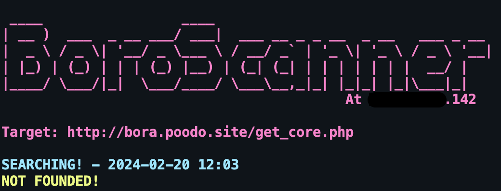
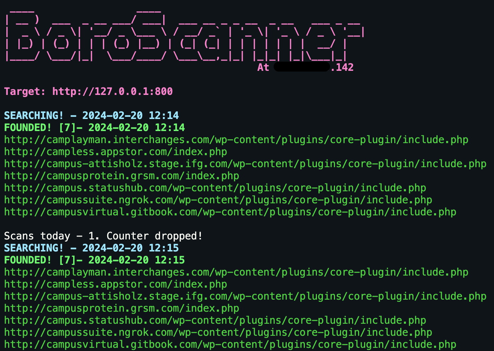
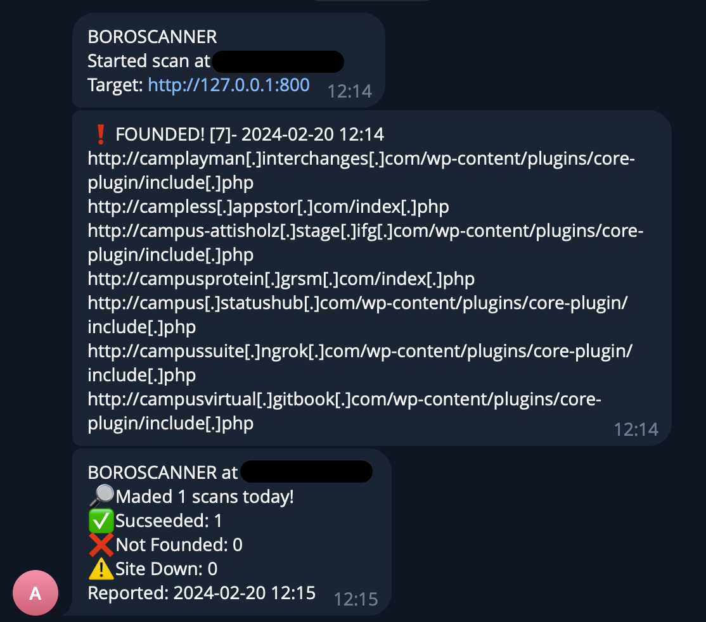

# BORO Scanner
## Malware database scanner with telegram reporting


## Description:
### All what you need for start checkig:
#### 1) Install requirments:
```
python3 -m pip install requests
python3 -m pip install termcolor
```
OR
```
pip3 install requests
pip3 install termcolor
```
#### 2) Fill config file with your Telegram bot credentials:

```
TOKEN = "BOT_TOKEN"
ID = "CHAT_ID"
```

#### 3) Choose domain example which will be searched on the resource:

```Python
domain = r'(.*\.by\/.*)' #For .by sites
domain = r'(.*\.ru\/.*)' #For .ru sites
domain = r'(.*\.org\/.*)' #For .org sites
#And etc
```
P.S. You can use custom REGEX for search

#### 4) Start search at your server by using:
```Python
python3 checkbora.py 300 #For scan wich check resource every 300 seconds
```

## Example:


### Script output example



### Script Telegram report example